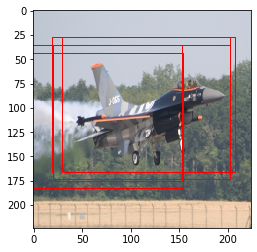
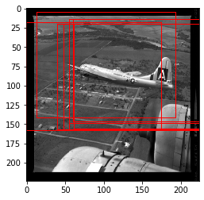
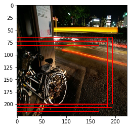

# Region Proposal Network 

Region Proposal Network **(RPN)** is a part of Faster R-CNN algorithm that is used to propose regions that contains the targetted objects. These proposed regions are then refined and the objects inside the regions will be classified. RPN can also be used as a standalone network as a one-class object detector. In this implementation, a VGG-16 network was first used to classify between aeroplanes and bicycles. RPN uses this pre-trained model as the backbone to enable the localization of aeroplanes in images.

Short notes are provided for a clearer understanding and all implementation is done on RPN.ipynb file only. Below are the results of the RPN on localizing airplanes.

### Original Input Images 
 

### Predicted Bounding Boxes
 

### License
_________
 MIT
